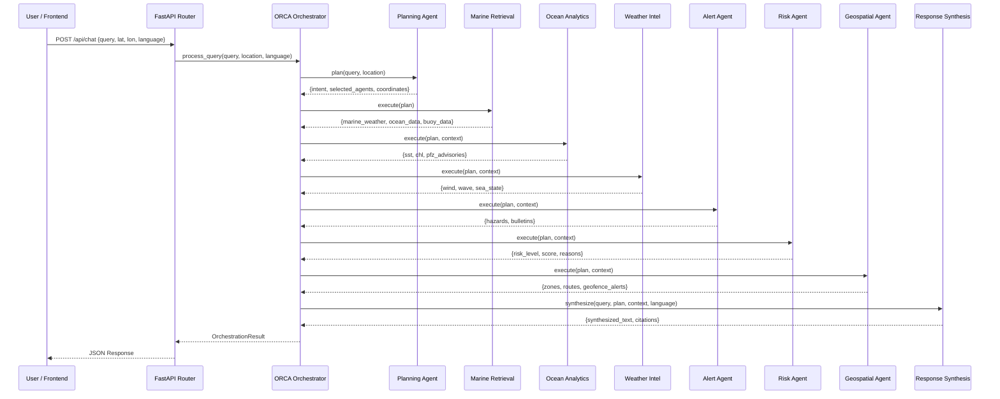

# 🏗️ ORCA — System Architecture Document

> **ORCA** — Marine EcOsystem Reasoning with Collaborative Agents  
> **SIH 2026** | Problem Statement ID: `SIH26176`

---

## High-Level Architecture Diagram

```
┌─────────────────────────────────────────────────────────────────────────┐
│                          FRONTEND (PWA)                                 │
│  ┌─────────────┐  ┌─────────────────┐  ┌─────────────┐  ┌───────────┐ │
│  │  Chat HUD   │  │  Leaflet.js Map │  │  Telemetry  │  │  Voice    │ │
│  │  + Agent    │  │  + SST Heatmap  │  │  Charts     │  │  (Speech  │ │
│  │  Trace UI   │  │  + GIS Layers   │  │  + Timeline │  │  API)     │ │
│  └──────┬──────┘  └───────┬─────────┘  └──────┬──────┘  └─────┬─────┘ │
│         │                 │                    │               │       │
│         └─────────────────┴────────────────────┴───────────────┘       │
│                               │ HTTP (Fetch API)                       │
└───────────────────────────────┼─────────────────────────────────────────┘
                                │
                                ▼
┌───────────────────────────────────────────────────────────────────────────┐
│                     FASTAPI BACKEND (Python 3.13)                        │
│                                                                          │
│  ┌──────────────────────────── API Layer ────────────────────────────┐   │
│  │  POST /api/chat    │  GET /api/map/layers  │  POST /api/routes/  │   │
│  │  GET /api/pfz/zones│  GET /api/health      │  analyze            │   │
│  └──────────────────────────────┬────────────────────────────────────┘   │
│                                 │                                        │
│  ┌──────────────────────────────▼────────────────────────────────────┐   │
│  │              ORCA ORCHESTRATOR (orca_orchestrator.py)              │   │
│  │   Executes the multi-agent pipeline with execution tracing        │   │
│  └──────────┬───────────────────────────────────────────────────────┘   │
│             │                                                           │
│  ┌──────────▼─────────────────────────────────────────────────────┐    │
│  │                    8 SPECIALIZED AGENTS                         │    │
│  │  ┌─────────────┐  ┌──────────────┐  ┌───────────────────────┐ │    │
│  │  │  Planning    │  │  Marine Data │  │  Ocean Analytics      │ │    │
│  │  │  Agent       │  │  Retrieval   │  │  Agent                │ │    │
│  │  └─────────────┘  └──────────────┘  └───────────────────────┘ │    │
│  │  ┌─────────────┐  ┌──────────────┐  ┌───────────────────────┐ │    │
│  │  │  Weather     │  │  Alert &     │  │  Risk Assessment      │ │    │
│  │  │  Intelligence│  │  Notification│  │  Agent                │ │    │
│  │  └─────────────┘  └──────────────┘  └───────────────────────┘ │    │
│  │  ┌─────────────┐  ┌──────────────┐                            │    │
│  │  │  Geospatial  │  │  Response    │                            │    │
│  │  │  Analysis    │  │  Synthesis   │                            │    │
│  │  └─────────────┘  └──────────────┘                            │    │
│  └────────────────────────────────────────────────────────────────┘    │
│             │                          │                               │
│  ┌──────────▼──────────┐  ┌────────────▼───────────────────────────┐  │
│  │  SCIENTIFIC ENGINES  │  │  DATA CONNECTORS                      │  │
│  │  • Risk Engine       │  │  • Open-Meteo Marine & Atmospheric    │  │
│  │  • Route Engine      │  │  • NOAA CoastWatch / ISRO MOSDAC      │  │
│  │  • PFZ Engine        │  │  • INCOIS & IMD Advisory Bulletins     │  │
│  │  • Data Normalization│  │  • National Data Buoy Programme       │  │
│  │  • Freshness Validator│  │  • Maritime GIS Boundaries           │  │
│  └──────────────────────┘  └───────────────────────────────────────┘  │
│             │                          │                               │
│  ┌──────────▼──────────────────────────▼───────────────────────────┐  │
│  │              DATABASE / SPATIAL LAYER                            │  │
│  │  ┌───────────────────┐  ┌─────────────────────────────────────┐│  │
│  │  │  Supabase Cloud   │  │  Embedded PostGIS Spatial Index     ││  │
│  │  │  (PostgreSQL +    │  │  (Ray-casting, Haversine distance,  ││  │
│  │  │   PostGIS)        │  │   Bounding box, Point-in-polygon)   ││  │
│  │  └───────────────────┘  └─────────────────────────────────────┘│  │
│  └─────────────────────────────────────────────────────────────────┘  │
│                                                                       │
│  ┌─────────────────────────────────────────────────────────────────┐  │
│  │                    UTILITIES                                     │  │
│  │  • LLM Client (Claude 3.5 Sonnet + Deterministic Fallback)      │  │
│  │  • Geo Toolkit (Haversine, Bearing, Port Registry, Geocoder)    │  │
│  │  • Logger (Structured ORCA logging)                              │  │
│  └─────────────────────────────────────────────────────────────────┘  │
└───────────────────────────────────────────────────────────────────────┘
```

---

## Directory Structure

```
ORCA_FINAL/
├── backend/
│   ├── main.py                         # FastAPI application entry point
│   ├── config.py                       # Pydantic settings (env-driven)
│   ├── agents/                         # 8 Specialized Domain Agents
│   │   ├── planning_agent.py           # Agent 1: LLM intent decomposition
│   │   ├── marine_data_retrieval_agent.py  # Agent 2: Multi-source data ingestion
│   │   ├── ocean_analytics_agent.py    # Agent 3: SST/Chl-a analysis & PFZ
│   │   ├── weather_intelligence_agent.py   # Agent 4: Wind, wave, sea state
│   │   ├── alert_notification_agent.py # Agent 5: INCOIS/IMD bulletins
│   │   ├── risk_assessment_agent.py    # Agent 6: Deterministic safety scoring
│   │   ├── geospatial_analysis_agent.py    # Agent 7: PostGIS & routing
│   │   └── response_synthesis_agent.py # Agent 8: Grounded report synthesis
│   ├── api/                            # FastAPI Router Endpoints
│   │   ├── chat.py                     # POST /api/chat (main orchestration)
│   │   ├── map.py                      # GET /api/map/layers (GIS layers)
│   │   ├── routes.py                   # POST /api/routes/analyze (routing)
│   │   ├── pfz.py                      # GET /api/pfz/zones (fishing zones)
│   │   └── health.py                   # GET /api/health (system status)
│   ├── data_connectors/                # External Data Feed Integrations
│   │   ├── base.py                     # Base connector interface
│   │   ├── open_meteo.py               # Open-Meteo Marine & Atmospheric
│   │   ├── ocean_sst_chl.py            # NOAA/ISRO SST + Chlorophyll-a
│   │   ├── advisories.py               # INCOIS/IMD Marine Advisories
│   │   ├── in_situ.py                  # OMNI Buoy Network + Tide Gauges
│   │   └── gis_boundaries.py           # Maritime GIS Zone Boundaries
│   ├── services/                       # Deterministic Scientific Engines
│   │   ├── risk_engine.py              # Multi-factor safety scoring (0-100)
│   │   ├── route_engine.py             # Dual marine route calculation
│   │   ├── pfz_engine.py               # ISRO/INCOIS PFZ generation
│   │   ├── data_normalization.py       # Observation normalization pipeline
│   │   ├── freshness.py                # Data freshness validator
│   │   └── validation.py               # Input validation utilities
│   ├── database/                       # Persistence & Spatial Layer
│   │   ├── models.py                   # Pydantic v2 domain models
│   │   ├── schema.sql                  # PostgreSQL/PostGIS DDL schema
│   │   ├── supabase.py                 # Supabase client wrapper
│   │   └── spatial_index.py            # Embedded spatial query engine
│   └── utils/                          # Cross-cutting Utilities
│       ├── llm_client.py               # Anthropic Claude + fallback engine
│       ├── geo.py                      # Geodesic math + port registry
│       └── logger.py                   # Structured logging
├── frontend/
│   ├── index.html                      # Main SPA entry point (52KB)
│   ├── manifest.json                   # PWA manifest
│   ├── sw.js                           # Service Worker (offline caching)
│   ├── css/
│   │   └── style.css                   # Marine-tech UI design system (45KB)
│   ├── js/
│   │   ├── app.js                      # Core application logic (25KB)
│   │   ├── map.js                      # Leaflet.js map integration (23KB)
│   │   ├── layers.js                   # GIS layer management (13KB)
│   │   ├── agents_ui.js               # Agent trace visualization (6KB)
│   │   ├── resizable_panels.js        # Draggable panel layout (6KB)
│   │   └── charts.js                   # Telemetry chart rendering (4KB)
│   └── assets/                         # Icons, logos, media
├── data/                               # Static reference datasets (8 files)
├── scripts/
│   └── download_datasets.py            # Data ingestion automation
├── tests/                              # Test suite
│   ├── test_connectors.py              # Data connector integration tests
│   ├── test_risk_engine.py             # Risk engine unit tests
│   ├── test_route_engine.py            # Route engine unit tests
│   ├── test_sih_scenarios.py           # SIH problem scenario tests
│   └── verify_endpoints.py             # API endpoint verification
├── .env                                # Environment configuration
├── .env.example                        # Environment template
├── requirements.txt                    # Python dependencies
├── Dockerfile                          # Container build
├── docker-compose.yml                  # Container orchestration
├── README.md                           # Project overview
├── BRAIN.md                            # System intelligence architecture
├── ARCHITECTURE.md                     # This file
├── API_REFERENCE.md                    # Complete API documentation
├── CONTRIBUTING.md                     # Contribution guidelines
└── DEPLOYMENT.md                       # Deployment guide
```

---

## Technology Stack

| Layer | Technology | Purpose |
|---|---|---|
| **Backend Framework** | Python 3.13 + FastAPI + Uvicorn | High-performance async API server |
| **Data Validation** | Pydantic v2 | Type-safe request/response models |
| **AI Reasoning** | Anthropic Claude 3.5 Sonnet | Intent understanding + report synthesis |
| **Spatial Database** | Supabase (PostgreSQL + PostGIS) | Cloud-hosted geospatial persistence |
| **Embedded Spatial** | Custom Ray-Casting + Haversine Engine | Zero-dependency spatial queries |
| **HTTP Client** | httpx | Async external API calls |
| **Frontend** | HTML5 + Vanilla CSS + Vanilla JS | Zero-framework SPA |
| **Mapping** | Leaflet.js | Interactive ocean map with GIS layers |
| **Voice** | Web Speech API | Multilingual speech input/output |
| **PWA** | Service Worker + Web Manifest | Offline capability + installable app |
| **Testing** | pytest | Automated test suite |
| **Containerization** | Docker + Docker Compose | Production deployment |

---

## Request Flow (POST /api/chat)



---

## Data Model Summary

### Core Response: `OrchestrationResult`

```python
OrchestrationResult:
  query_id: str                          # UUID for audit trail
  query_text: str                        # Original user query
  intent: str                            # Classified intent
  target_location: str                   # Resolved location name
  target_coordinates: {lat, lon}         # Geocoded coordinates
  selected_agents: List[str]             # Activated agents
  execution_trace: List[AgentTraceStep]  # Step-by-step agent log
  synthesized_response: str              # Final human-readable report
  risk_assessment: RiskAssessment        # Safety verdict
  telemetry: OceanTelemetrySummary       # Current ocean parameters
  forecast_timeline: List[Dict]          # Hourly forecast
  pfz_advisories: List[PFZAdvisory]      # Fishing zone recommendations
  routes: List[CandidateRoute]           # Navigable routes
  active_hazards: List[HazardAdvisory]   # Active warnings
  evidence_citations: List[SourceCitation]  # Data provenance
  processing_time_ms: float              # Total pipeline latency
```

---

## Security Considerations

1. **CORS**: Configured with wildcard origins for development; should be restricted in production.
2. **No Authentication**: Current version is designed for SIH hackathon demonstration. Production deployment should add JWT/API key authentication.
3. **API Key Management**: Anthropic and Supabase keys stored in `.env` (never committed to version control).
4. **Input Sanitization**: User queries are stripped and validated before processing.
5. **Rate Limiting**: Not implemented in current version; recommended for production.

---

*ORCA Architecture v1.0 — SIH 2026 (Problem ID: SIH26176)*
